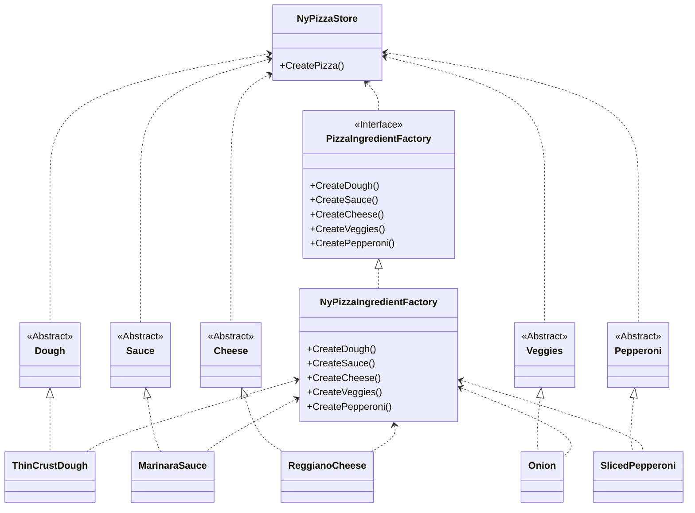

This project is example for Chapter 4.

For begin we have some pizza store thar cooking pizzas.
```csharp
Pizza pizza = type switch
   {
       "cheese" => new NyCheesePizza("Marinara","Thin", new[]{"Gouda", "Mozzarella", "Nut"}),
       "pepperoni" => new NyPepperoniPizza("Marinara","Thin", new[]{"Tomato", "Mozzarella"}),
       _ => throw new ArgumentOutOfRangeException(nameof(type), "Unknown pizza type")
   };
pizza.Prepare();
pizza.Bake();
pizza.Cut();
pizza.Box();
return pizza;
```
In this chapter we found problem - for each type of pizza we need create new instances. What we need to do if in future we will have to add new pizzas? New cities/regions/countries?
We need to add each new class for each of new products.

But we can create additional class that can return pizza by type. And this class - simple example of factory.
We just need to add `SimpleFactory` to our store and call method `CreatePizza` which returns a new pizza or throws exception if that type is not supported.

We can create simple factory for all new regions. Also we need add abstract class or interface `Pizza`. This will be base class for all pizzas in each region. After that `NySimpleFactory` will returns only pizzas for New York ("_Ny{PizzaName}_") etc.

For ingredients we also added a factory (**abstract factory**) - interface with necessary methods:
* create dough - given regional features 
* create pepperoni - for adding pepperoni in pizza
* create cheese - add cheese to pizza
* etc

With implementation of this interface we can create ingredients for pizza independently of region.

For example we have implemented this interface in `NyIngredientFactory` class. And now we have an easy way to add new pizzas to our menu with all regional specialties (such as pizza sauce, dough, etc.)

For what we need to create a new factory class? In one region we need sliced pepperoni accross, in other - sliced along, in third - whole. With this factory we have next rule - if in that region somebody wants to order pizza, we want this type of pepperoni.

