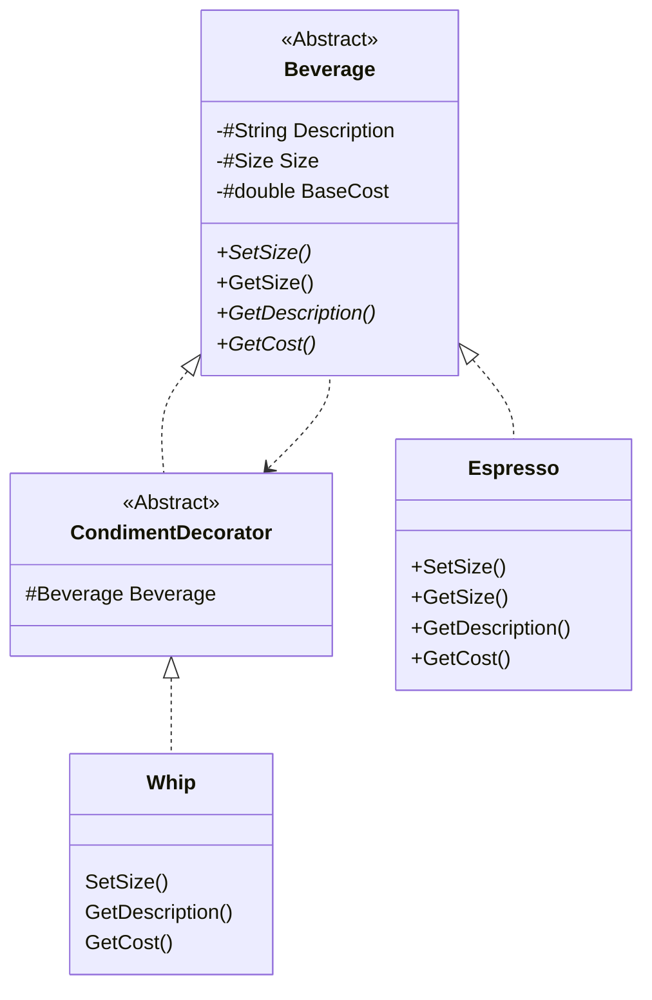

This project is example of Decorator design pattern.

At first we need to create some abstract class (in this case is Beverage abstract class) with abstract methods:
```csharp
public abstract class Beverage
{
    private protected string Description;
    private protected Size Size = Size.TALL;
    private protected double BaseCost;

    public abstract void SetSize(Size size);

    public Size GetSize() => Size;
    
    public abstract string GetDescription();

    public abstract double GetCost();
}
```

Then we need to decorate base class:
```csharp
public abstract class CondimentDecorator : Beverage
{
    protected Beverage Beverage;

    protected CondimentDecorator(Beverage beverage)
    {
        this.Beverage = beverage;
    }
}
```
After that all implementations of `CondimentDecorator` will take a `Beverage` instance from constructor. 

With this pattern we don't need create new implementation of base class for all new additional options. For example if tomorrow bosses decides to create new condiment to menu we just need to implement `CondimentDecorator` with needed functional. We don't need to create `Espresso` class with this or all other condiments.



As can see from this diagram next code:

```csharp
Beverage espresso = new Espresso();
espresso = new Mocha(espresso); // adding mocha to espresso
espresso  = new Whip(espresso); // whipping espresso with mocha
Console.WriteLine($"{espresso.GetDescription()} cost {espresso.GetCost()} $");
```

Will have next output:

```text
Espresso, Mocha, Whip cost 0,9500000000000001 $
```

We decorated the `Espresso` instance with condiment soy and whiped it.

With pattern Decorator we don't need to recreate description and calculation of cost in each condiment. We just call th beverage's method `GetCost` or `GetDescription` and add for result our additional value